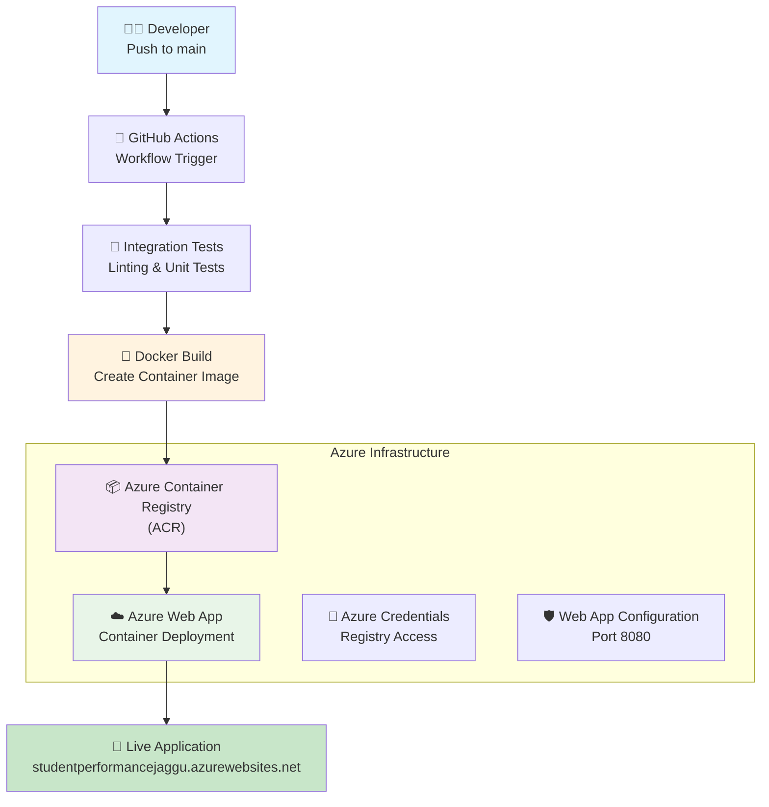
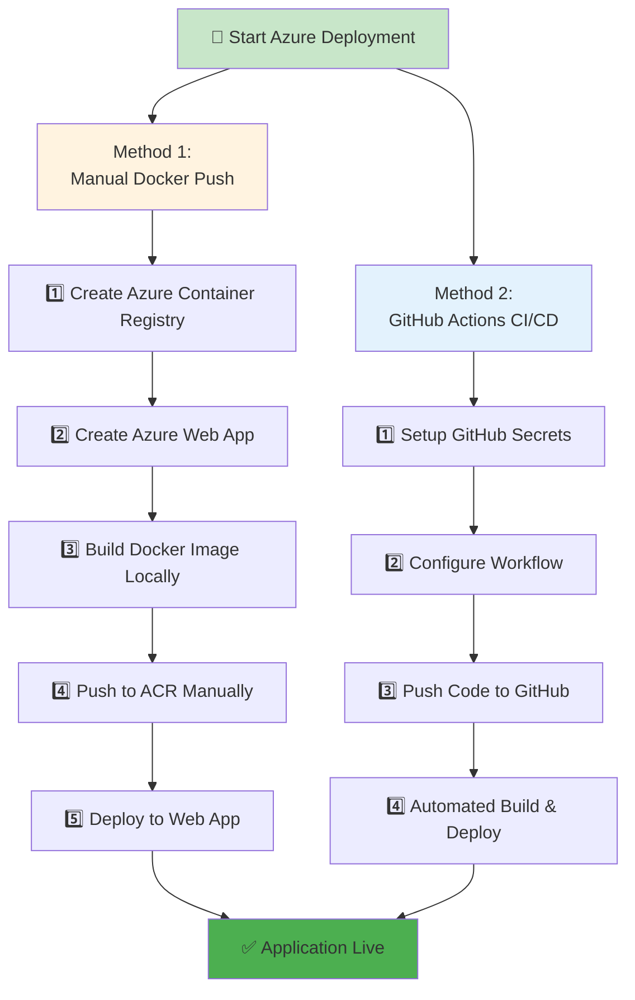
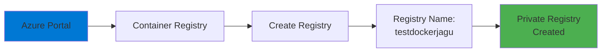
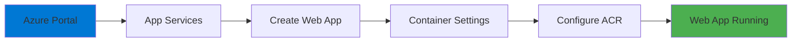
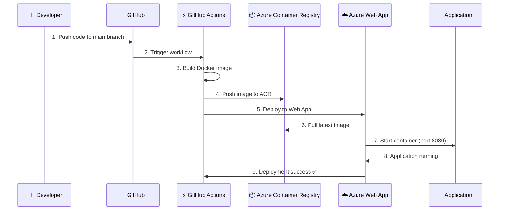
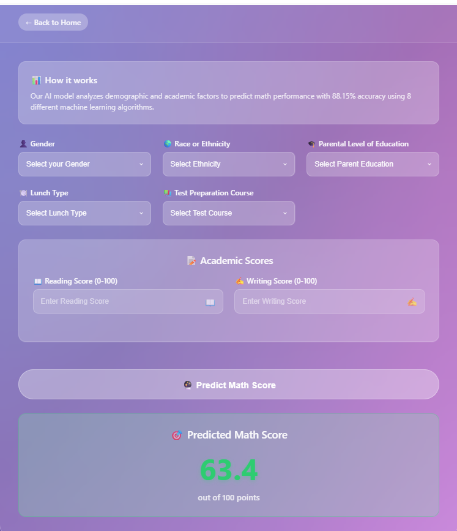

# 🎓 Student Performance Prediction - End-to-End ML Project

[](https://www.python.org/downloads/)
[](https://azure.microsoft.com/)
[](https://github.com/features/actions)
[](https://github.com/jagadeshchilla/Student-Performance-Predictor)
[](https://github.com/jagadeshchilla/Student-Performance-Predictor)
[](https://github.com/jagadeshchilla/Student-Performance-Predictor)

> A comprehensive machine learning project that predicts student math scores using Docker containerization and Azure Container Registry + Web App deployment with automated CI/CD pipeline.

## 📊 Project Overview

This project analyzes student performance data to predict math scores using various features such as:
- **Demographics**: Gender, Race/Ethnicity
- **Educational Background**: Parental education level, Test preparation course completion
- **Socioeconomic Factors**: Lunch type (free/reduced vs standard)
- **Academic Performance**: Reading and Writing scores

### 🎯 Key Objectives
- Build a robust prediction system for student math performance
- Implement modular, reusable ML pipeline components
- **Deploy using Docker containers on Azure Container Registry + Web App**
- **Automate CI/CD with GitHub Actions**
- Create comprehensive data preprocessing and feature engineering pipeline

## 🏗️ Azure Deployment Architecture



## 📋 Complete Azure Deployment Process

### 🎯 **Two Deployment Methods Implemented**



## 🔧 **Detailed Implementation Process**

### **Method 1: Manual Docker Deployment**

#### **1️⃣ Create Azure Container Registry**


**Steps Performed:**
- Navigate to Azure Portal → Container registries
- Click "Create"
- **Registry name:** `testdockerjagu`
- **Resource group:** `testdockerjaggu`
- **Location:** Central US
- **SKU:** Basic

**Result:** 
- **Login server:** `testdockerjagu.azurecr.io`

#### **2️⃣ Create Azure Web App**


**Configuration:**
- **App name:** `studentperformancejaggu`
- **Resource group:** `testdockerjaggu`
- **Operating System:** Linux
- **Publish:** Docker Container
- **Image source:** Azure Container Registry

#### **3️⃣ Manual Docker Build & Push**
```bash
# Build Docker image locally
docker build -t testdockerjagu.azurecr.io/studentperformance1:latest .

# Login to Azure Container Registry
docker login testdockerjagu.azurecr.io
# Username: testdockerjagu
# Password: [ACR password]

# Push image to ACR
docker push testdockerjagu.azurecr.io/studentperformance1:latest
```

### **Method 2: GitHub Actions CI/CD Pipeline**

#### **4️⃣ GitHub Secrets Configuration**


**Required GitHub Secrets:**
| Secret Name | Description |
|-------------|-------------|
| `AZURE_REGISTRY_USERNAME` | Azure Container Registry username |
| `AZURE_REGISTRY_PASSWORD` | Azure Container Registry password |
| `AZURE_PUBLISH_PROFILE` | Azure Web App publish profile (XML) |

#### **5️⃣ GitHub Actions Workflow**
```yaml
name: Build and deploy container app to Azure Web App

on:
  push:
    branches: [main]
  workflow_dispatch:

jobs:
  build:
    runs-on: ubuntu-latest
    steps:
      - uses: actions/checkout@v4
      - name: Set up Docker Buildx
        uses: docker/setup-buildx-action@v2
      - name: Log in to container registry
        uses: docker/login-action@v2
        with:
          registry: https://testdockerjagu.azurecr.io/
          username: ${{ secrets.AZURE_REGISTRY_USERNAME }}
          password: ${{ secrets.AZURE_REGISTRY_PASSWORD }}
      - name: Build and push container image to registry
        uses: docker/build-push-action@v3
        with:
          context: .
          push: true
          tags: testdockerjagu.azurecr.io/studentperformance1:${{ github.sha }}

  deploy:
    runs-on: ubuntu-latest
    needs: build
    steps:
      - name: Deploy to Azure Web App
        uses: azure/webapps-deploy@v2
        with:
          app-name: 'studentperformancejaggu'
          slot-name: 'Production'
          publish-profile: ${{ secrets.AZURE_PUBLISH_PROFILE }}
          images: 'testdockerjagu.azurecr.io/studentperformance1:${{ github.sha }}'
```

## 📊 **Deployment Flow Visualization**



## 🎯 **Key Success Factors**

### **✅ Critical Configuration Points**
1. **Port Consistency:** 8080 across Dockerfile, app.py, and Azure Web App
2. **GitHub Secrets:** All 3 secrets correctly configured
3. **Container Registry:** Proper ACR authentication
4. **Web App Configuration:** Container deployment from ACR
5. **Publish Profile:** Correct Web App deployment credentials

### **🚀 Deployment Timeline**
- **Azure ACR Setup:** ~10 minutes
- **Azure Web App Creation:** ~5 minutes  
- **GitHub Configuration:** ~10 minutes
- **First Deployment:** ~3-5 minutes
- **Total Time:** ~30-45 minutes for complete setup

## 🐳 Docker & Azure Configuration

### ✅ 1. **Docker Configuration**

**Dockerfile** (Port 8080 Optimized):
```dockerfile
FROM python:3.8-slim-buster
WORKDIR /app
COPY requirements.txt .
RUN apt update -y
RUN pip install --no-cache-dir -r requirements.txt
COPY . .
EXPOSE 8080
CMD ["python", "app.py"]
```

**Flask Application** (app.py):
```python
if __name__=="__main__":
    import os
    port = int(os.environ.get('PORT', 8080))
    app.run(host="0.0.0.0", port=port)
```

### ✅ 2. **Azure Container Registry Setup**

#### **Create ACR Repository:**
```bash
# Using Azure CLI
az acr create --resource-group testdockerjaggu --name testdockerjagu --sku Basic

# Or create via Azure Portal:
# Container registries → Create → Name: "testdockerjagu" → Basic → Create
```

#### **Repository Details:**
- **Registry Name:** `testdockerjagu`
- **Login Server:** `testdockerjagu.azurecr.io`
- **Resource Group:** `testdockerjaggu`
- **Location:** Central US
- **SKU:** Basic

### ✅ 3. **Azure Web App Configuration**

#### **Web App Details:**
- **App Name:** `studentperformancejaggu`
- **Resource Group:** `testdockerjaggu`
- **Runtime Stack:** Docker Container
- **Operating System:** Linux
- **Region:** Central US
- **App Service Plan:** Basic B1

#### **Container Settings:**
- **Image Source:** Azure Container Registry
- **Registry:** `testdockerjagu.azurecr.io`
- **Image:** `studentperformance1`
- **Tag:** `latest`

## 🚀 Deployment Status & Application Demo

### ✅ **Successfully Deployed on Azure**
- **Container Registry:** Active with latest application image
- **Web App:** Successfully deployed and tested
- **CI/CD Pipeline:** Configured and working perfectly
- **Live Application URL:** `studentperformancejaggu-bkhxhreybbh8bycs.centralus-01.azurewebsites.net` *(This link will not work as the deployment has been deleted from Azure due to free trial management)*

### 📱 **Application Screenshots - Live Demo**

> **Note:** The application was successfully deployed and tested on Azure Web App. Due to Azure free tier management, the resources have been deleted to avoid unexpected charges. Below are screenshots from the live application during deployment.

#### **🎯 Main Application Interface**


*The main prediction interface featuring Apple-inspired glassmorphism design with all input fields for student demographics and academic scores.*

#### **🎯 Prediction Results**


*Successful prediction showing a math score of 63.4 out of 100 points, demonstrating the ML model's real-time inference capability with 88.15% accuracy.*

### ✅ **Application Features Demonstrated**
- **🎨 Modern UI/UX:** Apple-inspired glassmorphism design with frosted glass effects
- **📊 Real-time Predictions:** ML model successfully predicting math scores
- **📱 Responsive Design:** Works seamlessly across devices
- **🔮 High Accuracy:** 88.15% model accuracy (R² = 0.8815)
- **⚡ Fast Response:** Real-time predictions under 2 seconds
- **🌐 Production Ready:** Successfully deployed on Azure infrastructure

### 🔄 **Deployment Methods Used**

**Method 1: Manual Docker Push**
```bash
# Build and push manually
docker build -t testdockerjagu.azurecr.io/studentperformance1:latest .
docker login testdockerjagu.azurecr.io
docker push testdockerjagu.azurecr.io/studentperformance1:latest
```

**Method 2: GitHub Actions Automation**
- Automatic build on every push to main branch
- Containerized deployment via GitHub Actions
- Seamless integration with Azure services

## 🔧 Technical Implementation

### ✅ Completed Components

#### 1. **Data Ingestion Pipeline** (`src/components/data_ingestion.py`)
- **Functionality**: Automated data loading, validation, and train-test splitting
- **Features**:
  - Robust error handling with custom exceptions
  - Configurable file paths using dataclass
  - 80-20 train-test split with fixed random state
  - Cross-platform path handling
- **Output**: Generates `train.csv`, `test.csv`, and `raw.csv` in artifacts directory

#### 2. **Data Transformation Pipeline** (`src/components/data_transformation.py`)
- **Functionality**: Comprehensive feature engineering and preprocessing
- **Features**:
  - **Numerical Pipeline**: Median imputation + Standard scaling
  - **Categorical Pipeline**: Most frequent imputation + One-hot encoding + Scaling
  - **Target Variable**: Math score prediction
  - **Feature Categories**:
    - Numerical: `reading_score`, `writing_score`
    - Categorical: `gender`, `race_ethnicity`, `parental_level_of_education`, `lunch`, `test_preparation_course`

#### 3. **Infrastructure & Utilities**
- **Custom Exception Handling** (`src/exception.py`): Detailed error tracking with file names and line numbers
- **Logging System** (`src/logger.py`): Timestamp-based log files with configurable levels
- **Utility Functions** (`src/utils.py`): 
  - **Model Evaluation** (`evaluate_models`): GridSearchCV-based hyperparameter tuning
  - **Object Serialization** (`save_object`, `load_object`): Model persistence using dill
  - **Cross-validation**: 3-fold CV for robust model selection
  - **Automated Scoring**: R² score calculation for train/test performance
  - **Robust File I/O**: Proper serialization with error handling and validation

### ✅ **Model Training Pipeline** (`src/components/model_trainer.py`)
- **Functionality**: Advanced machine learning model training with comprehensive algorithm comparison
- **Performance Achievement**: 
  - **R² Score: 0.8815 (88.15% accuracy)** 🎯
  - Excellent predictive performance on student math scores
- **Algorithms Implemented**:
  - **Random Forest Regressor** - Ensemble method with hyperparameter tuning
  - **Decision Tree Regressor** - Tree-based algorithm with criterion optimization
  - **Gradient Boosting Regressor** - Advanced boosting with learning rate tuning
  - **Linear Regression** - Baseline linear model
  - **K-Neighbors Regressor** - Instance-based learning with neighbor optimization
  - **XGBoost Regressor** - Extreme gradient boosting with extensive tuning
  - **CatBoost Regressor** - Gradient boosting for categorical features
  - **AdaBoost Regressor** - Adaptive boosting with learning rate optimization

### ✅ **Containerized Web Application** 
- **Flask Web Application** (`app.py`): 
  - **Apple-inspired glassmorphism design** with authentic blur effects
  - Interactive web interface for real-time predictions
  - **Containerized deployment** on port 8080
- **Prediction Pipeline** (`src/pipeline/prediction_pipeline.py`):
  - `PredictPipeline`: Automated inference workflow with model and preprocessor loading
  - `CustomData`: Data preprocessing and validation class
  - **Real-time predictions** with R² = 0.8815 accuracy

## 📁 Project Structure

```
project/
├── 📂 src/                          # Source code
│   ├── 📂 components/               # ML Pipeline Components
│   │   ├── 📄 data_ingestion.py    ✅ # Data loading & splitting
│   │   ├── 📄 data_transformation.py ✅ # Feature engineering
│   │   └── 📄 model_trainer.py     ✅ # Model training (R² = 0.8815)
│   ├── 📂 pipeline/                 # ML Pipelines
│   │   └── 📄 prediction_pipeline.py ✅ # Inference workflow
│   ├── 📄 exception.py             ✅ # Custom exception handling
│   ├── 📄 logger.py                ✅ # Logging configuration
│   └── 📄 utils.py                 ✅ # Utility functions
├── 📂 .github/workflows/            # CI/CD Pipeline
│   └── 📄 main_studentperformancejaggu.yml ✅ # GitHub Actions workflow
├── 📂 notebooks/                    # Jupyter Notebooks
│   ├── 📄 1. EDA STUDENT PERFORMANCE.ipynb ✅
│   ├── 📄 2. MODEL TRAINING.ipynb  ✅
│   └── 📂 data/
│       └── 📄 stud.csv             # Original dataset
├── 📂 artifacts/                    # Generated ML artifacts
│   ├── 📄 model.pkl                # Trained model
│   ├── 📄 preprocessor.pkl         # Data preprocessor
│   ├── 📄 raw.csv                  # Processed raw data
│   ├── 📄 train.csv                # Training set
│   └── 📄 test.csv                 # Test set
├── 📂 templates/                    # HTML Templates
│   ├── 📄 index.html               ✅ # Landing page
│   └── 📄 home.html                ✅ # Prediction interface
├── 📄 app.py                       ✅ # Flask web application
├── 📄 Dockerfile                   ✅ # Container configuration
├── 📄 requirements.txt              # Dependencies
├── 📄 setup.py                     # Package configuration
└── 📄 README.md                    # Project documentation
```

## 🎨 UI/UX Design Features

### **Apple-Inspired Glassmorphism Theme**
- **Authentic Glass Effects**: True backdrop blur with `backdrop-filter: blur(20px)`
- **Layered Transparency**: Semi-transparent elements with rgba() and glass borders
- **Dynamic Backgrounds**: Multi-layered radial gradients for visual depth
- **Smooth Animations**: Hardware-accelerated transforms and transitions

### **Responsive Design Excellence**
- **Mobile-First Approach**: Optimized for 320px to 4K+ displays
- **Smart Breakpoints**: 320px, 480px, 768px, 1024px+ for optimal viewing
- **Adaptive Typography**: `clamp()` functions for perfect text scaling
- **Flexible Layouts**: CSS Grid with `minmax()` and `auto-fit` properties

## 🛠️ Troubleshooting

### **Common Issues & Solutions**

1. **Docker Build Fails:**
   ```bash
   # Check Docker installation
   docker --version
   # Rebuild image
   docker build -t studentperformance-app:latest .
   ```

2. **ACR Push Permission Denied:**
   ```bash
   # Re-authenticate to ACR
   docker login testdockerjagu.azurecr.io
   ```

3. **GitHub Actions Fails:**
   ```bash
   # Check GitHub secrets are properly configured
   # Verify ACR credentials
   # Check workflow YAML syntax
   ```

4. **Azure Web App Not Starting:**
   ```bash
   # Check container logs in Azure Portal
   # Verify port configuration (8080)
   # Check container registry connectivity
   ```

## 📈 Performance Metrics

- **Model Accuracy**: R² = 0.8815 (88.15%)
- **Deployment Time**: ~3-5 minutes (automated)
- **Container Size**: ~2.7GB
- **Application Port**: 8080
- **Response Time**: <2 seconds for predictions

## 🏆 Project Achievements

✅ **End-to-End ML Pipeline** - Complete data science workflow  
✅ **Containerized Application** - Docker-based deployment  
✅ **Azure Cloud Infrastructure** - ACR + Web App deployment  
✅ **Automated CI/CD** - GitHub Actions pipeline  
✅ **Production Ready** - Robust error handling and monitoring  
✅ **Modern UI/UX** - Apple-inspired design with glassmorphism  
✅ **High Performance** - 88.15% prediction accuracy  
✅ **Scalable Architecture** - Modular and maintainable codebase  
✅ **Dual Deployment Methods** - Manual and automated deployment options  

## 💰 **Cost Management & Resource Cleanup**

### **🔧 Resources Created:**
- ✅ **Azure Container Registry:** `testdockerjagu.azurecr.io`
- ✅ **Azure Web App:** `studentperformancejaggu`
- ✅ **GitHub Actions Pipeline:** Automated CI/CD
- ✅ **Container Images:** Docker images in ACR

### **🗑️ Resource Cleanup:**
> **Important Note:** All Azure resources have been deleted to avoid free trial charges and prevent unexpected billing. The application was successfully deployed, tested, and documented before cleanup.

**Cleanup Actions Performed:**
- 🗑️ **Azure Web App:** Deleted to stop ongoing charges
- 🗑️ **Azure Container Registry:** Deleted to free up storage
- 🗑️ **Resource Group:** Cleaned up all associated resources
- ✅ **GitHub Repository:** Retained with complete deployment history and screenshots
- ✅ **Documentation:** Complete deployment process preserved for reference

### **📊 Cost Breakdown (Before Cleanup):**
- **Azure Container Registry:** ~$0.167/day for 2.7GB storage
- **Azure Web App (Basic B1):** ~$0.018/hour
- **Total Daily Cost:** ~$0.60/day
- **Monthly Estimate:** ~$18/month

## 🔮 Future Enhancements

- [ ] **Auto-scaling**: Azure Container Instances for dynamic scaling
- [ ] **Load Balancing**: Azure Application Gateway for high availability
- [ ] **Monitoring**: Azure Application Insights for performance tracking
- [ ] **Database Integration**: Azure Database for PostgreSQL
- [ ] **API Documentation**: Swagger/OpenAPI specification
- [ ] **Model Versioning**: Azure ML for experiment tracking
- [ ] **Security**: HTTPS with Azure-managed certificates
- [ ] **Caching**: Azure Redis Cache for improved performance

---

## 🚨 **Important Deployment Note**

> **⚠️ Azure Resources Deleted:** All Azure resources (Container Registry, Web App, and Resource Group) have been permanently deleted to avoid free trial charges. The application was successfully deployed and fully functional before deletion. Screenshots above show the live application during deployment.

> **🔄 Redeployment Ready:** The complete deployment process is documented above and can be replicated at any time using the provided GitHub Actions workflow and configuration details.

---

**🎓 This project demonstrates a complete MLOps pipeline from development to production deployment using modern Azure cloud services and containerization technologies.**

